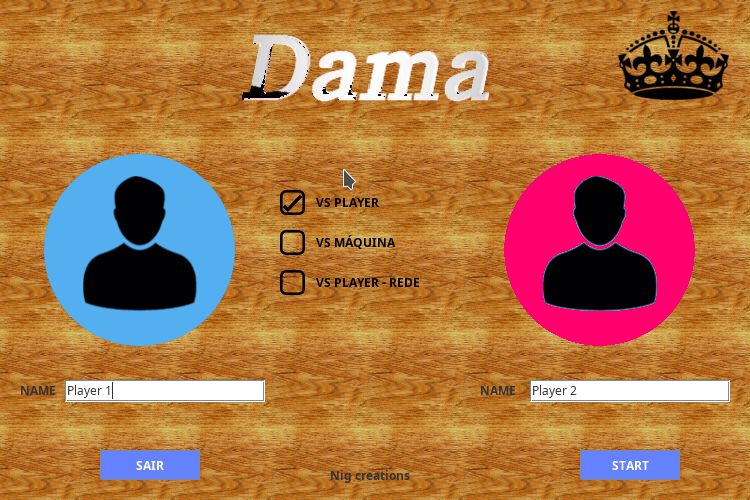
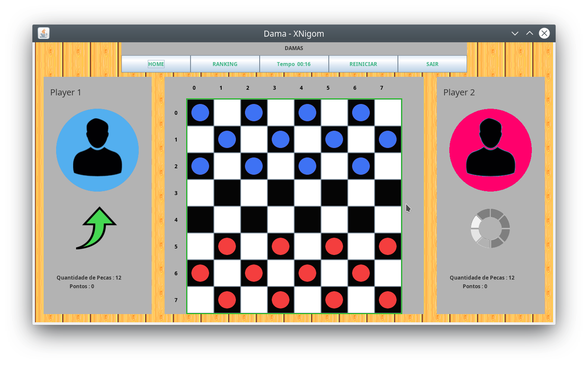
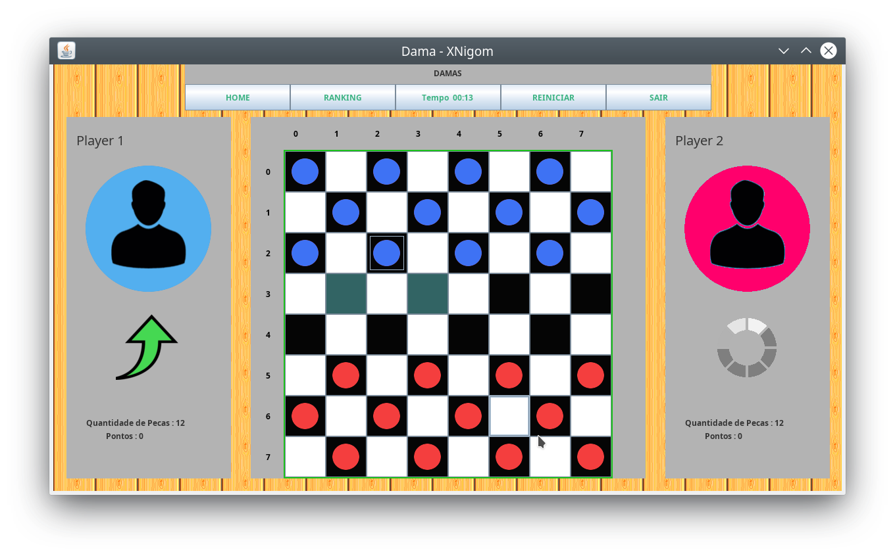
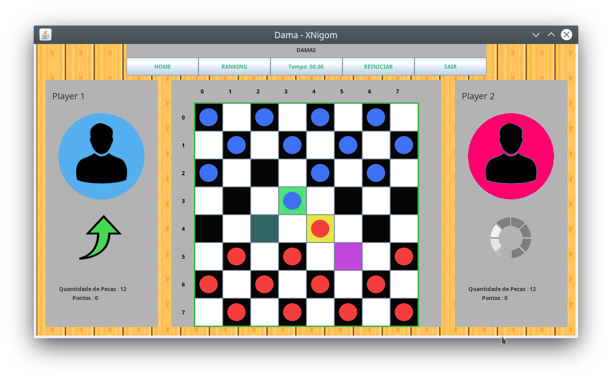
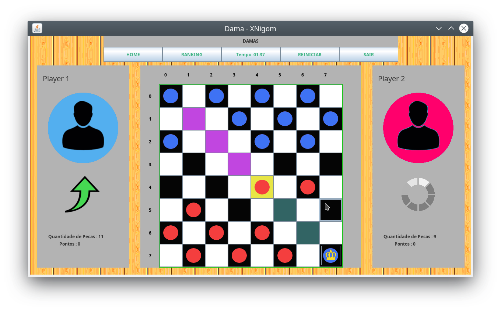

# Jogo de Dama

> Jogo implementado para disciplina de _Engenharia de Sofware II_ no cursos de sistemas de informação na Universidade Federal do Piauí - UFPI campus Picos.

## Tela Inicial

Nessa tela pode se escolher o nome dos jogadores, opções de game, como jogar contra alguem na mesma máquina, ou com outra pessoa pela rede(em implementação) e pela máquina.

## Tela inicial onde o jogo começa

